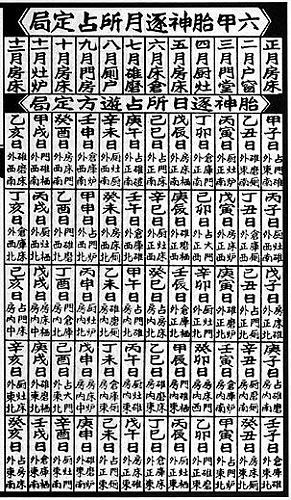

# lunisolar

**lunisolar** 是一个使用`Typescript`编写的专业农历库, 可取得各类农历数据，参考中国中代书籍，数据来源有依有据。

具体包含以下功能：

- ✅公历日期转阴历日期
- ✅八字查询
- ✅节气日期查询
- ✅每日胎神
- ✅五行纳音
- ✅建除十二神
- ✅神煞宜忌 <内容基于：协纪辨方书>
- ~~时辰凶吉~~ (planning)
- ~~紫微斗数~~ (planning)
- ...更多功能开发中

## 快速上手

```typescript
// 引入
import lunisolar from 'lunisolar'

// 使用

const d = lunisolar('2022/07/18 14:40')

// --- format ---

d.format('lY年 lM(lL)lD lH時')  // 可取得阴历日期 '二〇二二年 六月(大)二十 未時'
d.format('cY cM cD cH')  // 可取得八字：'壬寅 丁未 壬申 丁未'
d.format('YYYY-MM-DD HH:mm:ss') // 2022-07-18 14:40:00

// --- 阴历--- 

d.lunar.toString() // 二〇二二年六月二十未時
`${d.lunar}` // 二〇二二年六月二十未時
d.lunar.year // 2022
d.lunar.getYearName() // 二〇二二
d.lunar.month // 6 （如果是闰六月会返回106）
d.lunar.getMonthName() // 六月
d.lunar.day // 20
d.lunar.getDayName() // 二十
d.lunar.hour // 7 （返回从0天时算的时辰下标）
d.lunar.getHourName() // 未
d.lunar.isLeapMonth // false (是否闰月)

// --- 八字 ----

`${d.char8}` // 壬寅 丁未 壬申 丁未
d.char8.year.toString() // 壬寅  （取得年柱）
d.char8.month.toString() // 丁未  （取得月柱）
d.char8.day.toString() // 壬申 （取得日柱）
d.char8.hour.toString() // 丁未  （取得时柱）
d.char8.year.stem.toString() // 壬 (年柱天干)
d.char8.year.branch.toString() // 寅  (年柱地支)
d.char8.year.branch.hiddenStems // [甲, 丙, 戊]  （地支藏干的天干对象列表，顺序为本气、中气、余气）
// ...其它柱类似

// 节气
lunisolar('2022-07-23').solarTerm?.toString() // 大暑 （返回当天的节气，如果不是节气则solarTerm().solarTerm返回null）

```

## 前言

### * 阴历和阳历

中国传统历法，我们常称为农历，农历是阴阳合历，即包含了`阴历`和`阳历`，所以此库命名为`lunisolar`。个别人认为农历==阴历，这是不对的。

农历中，通过月相圆缺纪月，此属于阴历范畴，本库会以一个`Lunar`对象记录转换好的阴历数据。
而公历与阴历的转换没规律可言，故采用查表法进行转换，其数据来自香港天文台【[公历与农历日期对照表](https://www.hko.gov.hk/tc/gts/time/conversion1_text.htm#)】。其可查询年份范围为`[1901,2100]`。数据抓取和压缩的代码见仓库 [lunar-crawler](https://github.com/waterbeside/lunar-crawler)，此处不作详细介绍。

而属于阳历范畴的内容比较多，有二十四节气、天干地支等，传统很多术数多以阳历排盘，如八字、奇门遁甲...（也有少数以阴历排盘的，如紫微斗数）。其中二十四节气是阳历中十分重要的部分，其影响天干地支的换岁和换月。

### * 年和岁

在传统上，年和岁是两个不同的概念。

**年** 是指阴历正月初一到下一个正月初一的一个周期。

**岁** 是地球绕太阳一圈的周期，即一个二十四节气周期。一个周期结束而开始下一个周期，称为`换岁`

### * 节和气

我们常说的二十四节气，其实分为节和气两种，共十二节和十二气，节和气交替出现。天干地支纪月是以节换月的。

| -    |  -   | 节   | 气   |
| ---  | ---  | --- | --- |
|    | 寅月 | 立春 | 雨水 |
| 春 | 卯月 | 惊蛰 | 春分 |
|    | 辰月 | 清明 | 谷雨 |
|    | 巳月 | 立夏 | 小满 |
| 夏 | 午月 | 芒种 | 夏至 |
|    | 未月 | 小暑 | 大暑 |
|    | 申月 | 立秋 | 处暑 |
| 秋 | 酉月 | 露水 | 秋分 |
|    | 戌月 | 寒露 | 霜降 |
|    | 亥月 | 立冬 | 小雪 |
| 冬 | 子月 | 大雪 | 冬至 |
|    | 丑月 | 小寒 | 大寒 |

> 此时你应该了解，除了有阴历纪月，还有以天干地支为标记的阳历纪月法。

关于节气推算，尝试用“**节气积日公式**”计算

$$F = 365.242 *y + 6.2 + 15.22* x - 1.9 *math.sin(0.262* x)$$

F为与1900年1月0日的日期差，y为与1900年的年差，x为每年的节气序号

但计算出的个别结果与香港天文台【[公历与农历日期对照表](https://www.hko.gov.hk/tc/gts/time/conversion1_text.htm#)】有所差异，所以节气也是通过查表法计算来计算。

### * 生肖和换岁

我们知道天干地支是基于二十四节气来定的。在民间，如八字命理这类术数，通常以**立春**换岁，即到了立春，便更换下一个天干地支纪年，例如今年为甲子年，则到下一个立春，则换成乙丑年。

但是，并不是所有术数都是以立春换岁，例如中医的五运六气，则以大寒日换岁。 而奇门遁甲则以冬至换岁，中气换月。

> `lunisolar`默认使用**立春**换岁, 当然你也可以自定义换岁的节气。

**生肖**：生肖与十二地支是对应的，所以实际上生肖也是按节气更换，民间传统上是以立春换岁，所以生肖也是按立春更换。

> 另外，跟据 中国大陆国家标准：编号GB/T 33661-2017 《农历的编算和颁行》规定,
>
> “干支纪年的循环参考时间：对应于北京时间公历1984年2月2日0时起到1985年2月19日24时截止的农历年为甲子年。”
>
> 意思是按正月初一换岁，即生肖在正月初一更换。
> 这与传统的计算方式有所冲突，也许是为了方便大众记忆与使用。
> 由于大部分术数系统并不以正月初一换岁，所以lunisolar默认并不跟随此标准进行换岁（虽然可以通过配置设置成与国标一致，但不建议）。

### * 换日

传统子时是每一天的开始，子时对应的时间为 [23:00, 01:00), 所以lunisolar会在23:00进行换日。

### * 其它

[moment.js](https://github.com/moment/moment) 和 [dayjs](https://github.com/iamkun/dayjs) 是两个比较出名的时间工具库，为了符合大家的使用习惯，`lunisolar`针对公历（格里历）的部分操作将会尽量向`dayjs`看齐，并参考了其代码设计，但并不会cover它们的所有功能，如果你仅仅是对公历进行操作，推荐使用**dayjs**。lunisolar重点在于农历部分，例如`Lunisolar`的`format`方法和`diff`方法包含`dayjs`这两个方法的功能并与之保持一致，同时加入了对农历的处理，具体功能及使用请继续阅读文档。

## 1 安装

### 1.1 Nodejs

```bash
npm install lunisolar
# or
yarn add lunisolar
```

引入

```typescript
import lunisolar from 'lunisolar'
```

如果你使用typescript你需要设置：

```json5
{ //tsconfig.json
  "compilerOptions": {
    "esModuleInterop": true,
    "allowSyntheticDefaultImports": true,
  }
}
```

否则你必需这样引入:

```typescript
import * as lunisolar from 'lunisolar'
```

### 1.2 浏览器直接通过script引入

```html
<script src="path/to/lunisolar.js"></script>
<!-- or src from unpkg -->
<script src="https://unpkg.com/lunisolar@0.2.0/dist/lunisolar.js"></script>
```

## 2 解释 (创建Lunisolar对象)

### 2.1 解释 (Parse)

通过lunisolar函数创建一个Lunisolar对象：

`lunisolar(param: String | Number | Date | Lunisolar): Lunisolar`

```javascript
// 传入字符串
lunisolar('2022-07-18 14:40')
lunisolar('2022/07/18')
// 不传入参数时，为当前时间
lunisolar()
// 传入时间戳 (毫秒为单位)
lunisolar(1658289207143)
// 传入Date对象
lunisolar(new Date(2022, 6, 20))
// 传入Lunisolar对象时，将克隆一个Lunisolar对象
lunisolar(lunisolar())
```

### 2.2 克隆 Lunisolar 实例对象

```javascript
const lsr1 = lunisolar('2022-07-18 14:40')
const lsr2 = lsr1.clone()
```

## 3 Lunisolar类

通过`lunisolar()`函数获得一个`Lunisolar`实例

Lunisolar具有以下属性和方法

| 属性或方法  | 描述 | 参数  | 返回类型 |
| --- | ---  | --- | --- |
| lunar      | 阴历数据对象 | | [Lunar](#42-lunar类) |
| char8      | 八字对象 | | [Char8](#52-char8类) |
| term       | 返回当前日期的节气对象，如果不是节气，返回null | | [Term](#6-节气) \| null |
| getSeason()  | 取得当前季节 | | string |
| getSeasonIndex()  | 以春夏秋冬为顺序取得当前季节索引 | | number |
| toDate()   | 返回Date对象 | | Date |
| clone()    | 克隆当前Lunisolar对象 | | Lunisolar |
| unix()     | 返回以秒为单位的时间戳 | | number |
| format(formatStr: string) | 按指定格式格式化时间 | **formatStr**: string 时间将以这字符串格式进行格式化，例 'YYYY-MM-DD HH:mm:ss' | string |
| diff(date, unit, float) | 时间差计算 | **date**: number \| string \| Date \| Lunisolar <br> 与当前实例的时间进行比较的时间<br> **unit**: string <br>单位，如 year, lunarYear, month, lunarMonth 等<br> **float**: boolean <br>是否返回浮点数 | number
| valueOf()  | 返回Date对象的valueOf(), 即时间戳 | | number |
| toString() | 返回当前 Date对象的toUTCString() + 阴历的格式化后的日期时间: 例“Wed, 24 Aug 2022 14:50:51 GMT (二〇二二年七月廿七亥時)” | | string |

### 格式化数据 format

lunisolar(date).format(formatStr)格式化数据

示例：

```javascript
lunisolar('2022/07/18 14:40').format('YYYY/MM/DD HH:mm:ss SSS') // '2022/07/18 14:40:00 000'
lunisolar('2022/07/18 14:40').format('lY年 lMlD lH時') // '二〇二二年 六月二十 未時'
lunisolar('2022/07/18 14:40').format('lY年 lM(lL)lD lH時') // '二〇二二年 六月(大)二十 未時'
lunisolar('2022/07/18 14:40').format('lYn年 農歷lMn月lDn日 第lHn個時辰') // '2022年 農歷6月20日 第8個時辰'
lunisolar('2022/07/18 14:40').format('cY cM cD cH') // '壬寅 丁未 壬申 丁未'
lunisolar('2022/07/18 14:40').format('[八字：] cY cM cD cH') // '八字：壬寅 丁未 壬申 丁未'
lunisolar('2022/03/10').format('cZ年') // '虎年'
lunisolar('2022/03/10').format('cYs-cYb cMs-cMb cDs-cDb cHs-cHb') // ''壬-寅 丁-未 壬-申 丁-未''
```

根据传入的标识字符串获取格式化的日期。

要对字符进行转义，请将它们括在方括号中(例如 `[cY YY]` )

| 标识 | 示例 | 描述 |
| ---- | ---- | --- |
| lY  |  二〇二二 | 当年阴历正月初一所在的公历年 |
| lYn  |  2022 | 当年阴历正月初一所在的公历年, 数字形式开示 |
| lM  |  正月-十二月 | 阴历月 |
| lMn  |  1-12 | 阴历月, 以数字形式表示 |
| lD  | 初一 | 阴历日 |
| lDn  | 1 - 30 | 阴历日, 以数字形式表示 |
| lH  | 子 - 亥 | 时辰 |
| lHn  | 1 - 12 | 时辰序号，从1开始 |
| lDn  | 1 - 30 | 阴历日, 以数字形式表示 |
| lL  | 大 \| 小  | 阴历月是大月还是小月 |
| cY  | 甲子 | 八字年柱 |
| cYs  | 甲 | 八字年柱天干 |
| cYb  | 子 | 八字年柱地支 |
| cM  | 甲子 | 八字月柱 |
| cMs  | 甲 | 八字月柱天干 |
| cMb  | 子 | 八字月柱地支 |
| cD  | 甲子 | 八字日柱 |
| cDs  | 甲 | 八字日柱天干 |
| cDb  | 子 | 八字日柱地支 |
| cH | 甲子 | 八字日柱 |
| cHs  | 甲 | 八字日柱天干 |
| cHb  | 子 | 八字日柱地支 |
| cZ  | 鼠 | 生肖 （立春换岁，可通过config设置换岁时机） |
| t  | 1-24 | 节气，从小寒到冬至的序号，从1开始，如果该日不是节气，返回空字符串 |
| T  | 小寒-冬至 | 节气字符串，如果该日不是节气，返回空字符串 |
| YY  |  18 | 年，两位数 |
| YYYY | 2018 | 年，四位数 |
| M  | 1-12 | 月，从1开始  |
| MM | 01-12 | 月，两位数字 |
| MMM | Jan-Dec | 月，英文缩写 |
| D | 1-31 | 日 |
| DD | 01-31 | 日，两位数 |
| H | 0-23 | 24小时 |
| HH | 00-23 | 24小时，两位数 |
| h | 1-12 | 12小时 |
| hh | 01-12 | 12小时，两位数 |
| m | 0-59 | 分钟 |
| mm | 00-59 | 分钟，两位数 |
| s | 0-59 | 秒 |
| ss | 00-59 | 秒，两位数 |
| S | 0-9 | 毫秒（百），一位数 |
| SS | 00-99 | 毫秒（十），两位数 |
| SSS | 000-999 | 毫秒，三位数 |
| Z | -05:00 | UTC偏移 |
| ZZ | -0500 | UTC偏移，两位数 |
| A | AM / PM | 上/下午，大写 |
| a | am / pm | 上/下午，小写 |

### 时间差 diff

`lunisolar(date).diff(date, unit)` 可计算两个日期的时间差。

diff 方法包含两个参数：`date` 和 `unit`

参数：

- **date**: *string | number | Date | Lunisolar* 为传入作为比较的时间
- **unit**: *string* 时间单位，单位见下文表格，单位不区分大小写，支持复数和缩写形式。

| 单位 | 缩写 | 描述 |
| ----| --- | --- |
| lunarYear | lY | 阴历年 |
| lunarMonth | lM | 阴历月 |
| lunarDay | lD | 阴历日 |
| lunarHour | lH | 时辰 |
| day | d | 天 |
| month | M | 月份(0-11) |
| year | y | 年 |
| hour | h | 小时 |
| minute | m | 分钟 |
| second | s | 秒 |
| millisecond | ms | 毫秒 |

示例:

```javascript
const lsr1 = lunisolar('2020/01/01 00:00:00')
const lsr2 = lunisolar('2020/01/02 00:00:00')
lsr1.diff(lsr2, 'ms') // 86400000 
lsr1.diff(lsr2) // 86400000 默认以毫秒为单位
lsr1.diff(lsr2, 's') // 86400
lsr1.diff('2020/02/01 00:00:00', 'M') // 1 第一个参数可接受字符串

const lsr3 = lunisolar('2018/01/01')
const lsr4 = lunisolar('2022/02/02')
lsr3.diff(lsr4, 'lY') // 5 相差5个阴历年
lsr3.diff(lsr4, 'lM') // 51 相差51个阴历月
lunisolar('2018/02/10').diff('2022/02/02', 'lM', true) // 49.233333 相差约49.233个阴历月
lunisolar('2018/02/10 00:00:00').diff('2018/02/10 00:00:00', 'lM', true) // 49.233333 相差约49.233个阴历月

const a = '2020/01/02 00:00:00'
const b = '2020/01/01 00:00:00'
a.diff(b) // -86400000 a比b大的话将返回负数
```

> 阴历的时间差计算，如 2018/02/10 （二〇一七年十二月廿五）和 2018/02/16（二〇一八年正月初一）这两个日期，实际只相差五天，但因为两个所在的阴历年不同，所以`date1.diff(date1,'lY')` 计出的结果是1年，如果采用小数`date1.diff(date1,'lY', true)`，会算得 0.016 年。
>
> 而公历的diff会与`dayjs.diff`的计算方式一致，两个时间天数不足一年, 其取整数是不会按一年算的。如果你想农历也按此方式取整，可以先取浮点数再取整`parseInt(date1.diff(date1,'lY', true))`

## 4. 阴历数据

### 4.1 取得阴历

```javascript
const lsr = lunisolar('2022-07-18 14:40')
console.log(lsr.lunar.toString()) // 二〇二二年六月二十未時
console.log(lsr.lunar.month) // 6
console.log(lsr.lunar.day) // 20
console.log(lsr.lunar.hour) // 7
console.log(lsr.lunar.getMonthName()) // 六月
console.log(lsr.lunar.getDayName()) // 二十
console.log(lsr.lunar.getHourName()) // 未
console.log(lsr.format('lY年 lM(lL)lD lH時')) // 二〇二二年 六月(大)二十 未時
```

### 4.2 Lunar类

通过`lunisolar().lunar`取得`Lunar`对象实例

| 属性或方法  | 描述 | 参数  | 返回类型 |
| --- | ---  | --- | --- |
| leapMonth      | 当年农历的闰月，返回月份的数字， 如果没有闰月，返回0 | | number |
| leapMonthIsBig | 当年农历闰月是否大月 如果有闰月并且为大月，返回true || boolean |
| year           | 取得该阴历年正月初一所在的公历年 || number |
| month          | 取得当前阴历月的月号数字 | | number |
| day            | 取得当前阴历日号数字 | | number |
| hour           | 取得当前时辰下标 0 ~ 11 | | number |
| isLeapMonth    | 当前阴历月是否为闰月 |  | boolean |
| lunarNewYearDay | 取得当年正月初一对应的公历日期 |  | Date |
| lastDayOfYear | 取得当年的最后一天 |  | Date |
| getYearName()  | 取得该阴历年正月初一所在的公历年, 返回汉字字符串 | | string |
| phaseOfTheMoon | 取得当天月相，如朔、弦、望、晦等，不在上述其中之一者，返回空字符串 || string |
| getMonthName() | 取得当前阴历月, 返回汉字字符串 | | string |
| getDayName()   | 取得当前阴历日, 返回汉字字符串 | | string |
| getHourName()  | 取得当前时辰 | | string |
| valueOf()      | 返回Date对象的valueOf(), 即时间戳 | | number |
| toString()     | 返回当前阴历的格式化后的日期时间 如“二〇二二年六月二十未時” | | string |
| getLunarNewYearDay(year?: number) | 取得当年正月初一对应的公历日期 | year?: number<br> year为指定的年份，为空时则为Lunisolar已设定的年份 | Date |

## 5 八字（天干地支）

### 5.1 取得数据

```javascript
const lsr = lunisolar('2022-07-18 14:40')
console.log(lsr.char8.toString()) // '壬寅 丁未 壬申 丁未'
console.log(lsr.char8.year.toString()) // 壬寅
console.log(lsr.char8.year.stem.toString()) // 壬
console.log(lsr.char8.year.branch.toString()) // 寅
console.log(lsr.char8.month.toString()) // 丁未
console.log(lsr.char8.day.toString()) // 壬申
console.log(lsr.char8.hour.toString()) // 丁未

console.log(lsr.format('cY cM cD cH')) // '壬寅 丁未 壬申 丁未'
```

### 5.2 Char8类

通过`lunisolar().char8`取得`Char8`实例

| 属性或方法  | 描述 | 参数  | 返回类型 |
| --- | ---  | --- | --- |
| list           | 取得八字四柱的天干地支对象列表 | | [[SB](#53-sb类),SB,SB,SB] |
| year           | 年柱的干支对象 | | SB |
| month          | 月柱的干支对象 | | SB |
| day            | 日柱的干支对象 | | SB |
| hour           | 时柱的干支对象 | | SB |
| me             | 日主，即日柱的天干对象 |  | Stem |
| valueOf()      | 返回一个8位10进程数字，每两位分别表时年月日时的天干地支序号 | | number |
| toString()     | 返回格式化后的八字 如“壬寅 丁未 壬申 丁未” | | string |

### 5.3 SB类

SB干支对象, 为StemBranch的缩写

Char8的年月日时四柱为四个SB对象，参见4.2 Char8对象，list, year, month, day, hour的返回类型

| 属性或方法  | 描述 | 参数  | 返回类型 |
| --- | ---  | --- | --- |
| value | 取得60干支顺序索引值  | | number |
| stem | 天干对象 | | [Stem](#54-stem天干类) |
| branch | 地支对象 | | [Branch](#55-branch地支类)  |
| valueOf()      | 返回60干支顺序索引值 | | number |
| toString()     | 返回格式化后天干地支字符串如 “壬寅” | | string |
| takeSound | 五行纳音，需加载`advanced`插件, 参考 [#8 纳音](#8-纳音) | | string |

### 5.4 Stem天干类

| 属性或方法  | 描述 | 参数  | 返回类型 |
| --- | ---  | --- | --- |
| value | 天干索引值，范围[0, 9]  | | number |
| e5 | 五行属性对象 | | [Element5](#56-element5五行类) |
| trigram8 | 纳甲配卦 | | [Trigram8](#57-trigram8-八卦类)
| valueOf()      | 返回天干索引值 | | number |
| toString()     | 返回天干字符串| | string |

### 5.5 Branch地支类

| 属性或方法  | 描述 | 参数  | 返回类型 |
| --- | ---  | --- | --- |
| value | 地支索引值，范围[0, 11]  | | number |
| e5 | 五行属性对象 | | [Element5](#56-element5五行类) |
| hiddenStems | 取得地支所藏的天干对象列表，长度最多3个，分别为 `[本气, 中 气, 余气]` | | Stem[] |
| triad | 三合地支, 返回当前地支的另外两个与之三合的地支 | | [Branch, Branch] |
| valueOf()      | 返回地支索引值 | | number |
| toString()     | 返回地支字符串| | string |

### 5.6 Element5五行类

| 属性或方法  | 描述 | 参数  | 返回类型 |
| --- | ---  | --- | --- |
| value | 五行属性索引值，其顺序为`['木', '火', '土', '金', '水']`  | | number |
| valueOf()      | 返回五行属性索引值 | | number |
| toString()     | 返回五行属性字符串| | string |

### 5.7 Trigram8 八卦类

八卦中每卦都三爻，阴爻用0表示，阳爻用1表示。

所以每个卦可以用3位2进程表示：

| 卦名  | 符号 | 二进制  | 10进制 |
| --- | ---  | --- | --- |
| 乾  | ☰ | 111  | 7 |
| 坤  | ☷ | 000  | 0 |
| 坎  | ☵ | 010  | 2 |
| 离  | ☲ | 101  | 5 |
| 震  | ☳ | 001  | 1 |
| 巽  | ☴ | 110  | 6 |
| 艮  | ☶ | 100  | 4 |
| 兑  | ☱ | 011  | 3 |

| 属性或方法  | 描述 | 参数  | 返回类型 |
| --- | ---  | --- | --- |
| valueOf()      | 返回八卦数值 | | number |
| toString()     | 返回八卦字符串| | string |

## 6 节气

6.1 通过`lunisolar().solarTerm` 取得当前日期节气对象，如果当前日期不是节气，返回null

6.2 通过 `lunisolar().recentSolarTerm(nodeFlag:number)` 取得当前日期之前的最近的节气点

参数:
  nodeFlag : number
  nodeFlag = 0： 取得最近的节
  nodeFlag = 1:  取得最近的气
  nodeFlag = 2:  节和气哪个近就取哪个

6.3 通过 `lunisolar.SolarTerm` 取得`SolarTerm`类以调用静态方法

6.4 节气类 SolarTerm

| 属性或方法  | 描述 | 参数  | 返回类型 |
| --- | ---  | --- | --- |
| value | 取得节气索引值  | | number |
| valueOf()      | 返回节气索引值 | | number |
| toString()     | 返回节气字符串| | string |
| **静态方法**   static method| | |  |
| getNames()     | 返回节气字符串列表| | string[] |
| getYearTermDayList(year)   | 取得某年的节气日期列表| -  **year**: *number* <br> 指定某年 | number[] |
| getMonthTerms(year, month)   | 取得某年某月的两个节气的日期 | - **year**: *number* <br> 指定某年<br> - **month**: *number*<br> 某月 (1 ~ 12) | [number,number] |
| findDate(year)   | 取得某年指定节气的日期 | year: number <br> 指定某年 | [number, number, number] 分别为[year, month, day] |
| findNode(date, config)   | 查出指定日期属于哪个节气之后，并返回该节气及该节气日期 | - **year**: *number* <br> 指定日期<br> - **config**: {<br>  &nbsp;&nbsp; &nbsp;&nbsp;**lang**?: *string*, <br>&nbsp;&nbsp; &nbsp;&nbsp;**returnValue**?: *boolean* 返回值的第一个元素是返回SolarTerm对象，还是返回节气索引，默认为`ture`, 即返回节气索引。<br>&nbsp;&nbsp;  &nbsp;&nbsp;**nodeFlag**: *number* 0,1,2三个值可选，默认0，`0`返回`节`之后，`1`返回`气`之后，`2`返回最近的`节气`之后} | [`SolarTerm \| number`, `Date`] 分别为 [`节气或节气索引`，`该节气对应的日期`] |

## 7 胎神

古人认为怀孕以及孕期胎儿的好坏都与胎神有关。所以民间传统习俗里，家里一旦有孕妇，便有各种禁忌，以免惊动胎神。

胎神每日都会出现在不同的位置，参考《胎神逐日所占游方定局》。



其中天干地支与胎神位置的规律可用以下口诀记忆：

```text
  ----天干六甲胎神歌----
  甲己之日占在門，乙庚碓磨休移动。
  丙辛廚灶莫相干，丁壬倉庫忌修弄。
  戊癸房床若移整，犯之孕妇堕孩童。

  ----地支六甲胎神歌----
  子午二日碓须忌，丑未廁道莫修移。
  寅申火爐休要动，卯酉大門修当避。
  辰戌雞棲巳亥床，犯着六甲身堕胎。
```

### 7.1 用法

查询胎神要先导入 fetalGod 插件，

之后可使用lunisolar().fetalGod 取得胎神描述，

也可以使用lunisolar().fetalGodData 取得胎神数据。

示例：

```typescript
import fetalGod from 'lunisolar/plugins/fetalGod'
import lunisolar from 'lunisolar'

lunisolar.extend(fetalGod)

const lsr = lunisolar('2022-07-08')
lsr.fetalGod // 倉庫棲外東南
lsr.fetalGodData.stemPlace // 倉庫
lsr.fetalGodData.branchPlace // 雞棲
lsr.fetalGodData.direction // 外東南
lsr.fetalGodData.description // 倉庫棲外東南
```

fetalGodData 包含以下属性

| 属性  | 描述   | 返回类型 |
| --- | ---  | --- |
| stemPlace | 根据天干推算的胎神位置，有以下五种： ['門', '碓磨', '廚灶', '倉庫', '房床'] | string |
| branchPlace  | 根据地支推算的胎神位置，有以下六种：['碓', '廁', '爐', '門', '雞棲', '床']| string |
| direction | 胎神的方向，如'外东南'、'外西'、'内中' 等 | string |
| description | 胎神占方的完整描述，如："占門碓外東南" | string |

## 8 纳音

查询胎神要先导入 takeSound 插件，

之后可使用lunisolar().fetalGod 取得胎神描述，

也可以使用lunisolar().fetalGodData 取得胎神数据。

示例：

```typescript
import takeSound from 'lunisolar/plugins/takeSound'
import lunisolar from 'lunisolar'

lunisolar.extend(takeSound)

/**
  加载advance插件后，
  SB对象（天干地支对象）会添加一个takeSound属性，
 */
const lsr = lunisolar('2022-07-08')
lsr.char8.year.takeSound // 金箔金 （取得年干支的纳音）
// ...
lsr.char8.day.takeSound // 大海水 （取得日干支的纳音）
lsr.takeSound // 大海水 （取得日干支的纳音 等同于）

expect().toBe('大海水')
```

## 9 建除十二神

**建除十二神**，又称**十二值神**。即 “`建、除、满、平、定、执、破、危、成、收、开、闭`”共十二位神，每日轮值，周而复始，观所值以定吉凶。

十二值神已归到神煞类之下，请参考[神煞宜忌](doc/theGods.md)

## 10 神煞宜忌

神煞宜忌的所有内容，都基于 **《协纪辨方书》**

因其数据内容较多，故作为一个插件单独介绍，请点击跳转到[【神煞宜忌】](doc/theGods.md)查看介绍和使用说明

## 插件 plugins

lunisolar支持自定义插件以扩展功能

1，自定义插件

```typescript
import { PluginFunc, Lunisolar } from 'lunisolar'

// 为新添的属性加上类型声明 ()
declare module 'lunisolar' {
  interface Lunisolar {
    showExample: string
    exampleMethod(): void
  }
}

interface LunisolarEx extends Lunisolar {
  showExample: string
  exampleMethod(): void
}

const pluginName: PluginFunc = async (options, lsClass, lsFactory) => {
  const lsProto = lsClass.prototype as unknown as LunisolarEx
  // 添加属性
  lsProto.showExample = 'hello'

  // 添加方法
  lsProto.exampleMethod = function () {
    console.log('hello')
  }  
}
export default pluginName
```

2 使用插件

```typescript
import plugin from 'your/plugin/path/pluginName'
import lunisolar from 'lunisolar'

lunisolar.extend(plugin)

lunisolar().showExample // 'hello'
```

## 国际化

`lunisolar`返回数据默认用`繁体中文`，主要考虑到这类使用人群往往有繁体需求，而且繁体也易于直接翻译成简体（由于一简对多繁，繁体可直接转为简体，但简体不能直接转为繁体）。

尽管如此，lunisolar还是支持更改语言包。方法如下：

```javascript
import lunisolar from 'lunisolar'
// 加载英文语言包
import en from 'lunisolar/locale/en' 
lunisolar.locale(en)
// 此时，lunisolar将全属使用en作为默认语言
lunisolar('2017-12-01').char8.month.toString() // Xin-Hai

// 如果不想使用en作为全局默认语言，可通以下方法更改全局配置
lunisolar.config({
  lang: 'zh' // 设换默认语言为繁体中文
})

lunisolar('2017-12-01').char8.month.toString() // 辛亥

// 局部使用指定语言 （须已先以lunisolar.locale()方法加载对应语言包）
lunisolar('2017-12-01', { lang: 'en' }).char8.month.toString() // Xin-Hai

```

lunisolar内置的语言包有：

```typescript
// zh 繁体中文 (默认自动加载，请勿重复加载)
import zh from 'lunisolar/locale/zh' 
// zh-cn 简体中文
import zhCn from 'lunisolar/locale/zh-cn' 
// en 英文
import en from 'lunisolar/locale/en' 
// ja 日文
import ja from 'lunisolar/locale/ja'
```

### * 加载插件语言包

使用内置插件时，需要另外加载插件的语言包 （**默认使用的繁体中文无需手动加载**）

```typescript
import lunisolar from 'lunisolar'
import en from 'lunisolar/locale/en'
import takeSound from 'lunisolar/plugins/takeSound'
import takeSoundEn from 'lunisolar/plugins/takeSound/locale/en'

lunisolar.locale(en).locale(takeSoundEn)

```

### * 对语言包进行自定义

你可以对载入后的语言包进行修改，或者自定义一个语言包对原有的进行覆盖

例如:

```typescript
import lunisolar from 'lunisolar'
import type { Locale } from 'lunisolar'
// 自定义语言包
const myZh: Locale = {
  name: 'zh' // 此项必需设置，指定要自义的语言, 可设为任意字符串，如果设为已导入的语言名，后续设置的项将会覆盖原有项
  numerals: '零一二三四五六七八九十'.split(''),
  stems: ['a', 'b', 'c', 'd', 'e', 'f', 'g', 'h', 'i', 'j']
  branchs: ['A', 'B', 'C', 'D', 'E', 'F', 'G', 'H', 'I', 'J', 'K', 'L']
}

// 载入语言包
lunisolar.locale(myZh)

lunisolar('2022/07/18 14:40').format('lY年 lMlD lH時') //  返回内容变成'二零二二年 六月二十 H時' 原本为 '二〇二二年 六月二十 未時'
lunisolar('2022/07/18 14:40').format('cY') // 返回内容变成'iC' 原本为 '壬寅'
```

> 具体设置项可参考项目中的语言包， `/src/locale/zh.ts`
>
> 自定义语言包时，并非所有项都是必填的，未配置的项会默认使用zh语言包所设置的数据。
