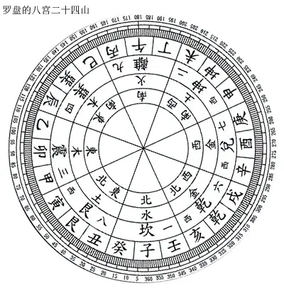

# 二十四山

## Direction24 类

| 属性或方法  | 描述 | 参数  | 返回类型 |
| --- | ---  | --- | --- |
| static create(value, config) | 静态方法，用于创建实例 | value: number \| Branch \| Stem \| Trigram8   config: {lang: string} | Direction24 |
| value | value为二十四山顺序索引值，子山为0，顺时针而行，壬山23结束 || number |
| sign | 所在山的对应对象 || Stem \| Branch \| Trigram8 |
| name | 所在山的对应对象的名称 || string |
| type | 所在山的对应对象的类名, 一般为'Branch' \| 'Stem' \| 'Trigram8' || string |
| angle | 所在山的角度，360度均分为24份，从子山为0度开始，顺时针行走，每山15度，到壬山345度结束 || string |
| direction | 方向名称，返回国际化翻译后的名称，即東南西北等八个方位的名称 || string |
| directionIndex | 方向名索引, 其顺序为九宫数号，即子坎宫（正北）为1，离宫（正南）为9, ...参考上图，或见表[九宫数](#九宫数) || string |

## 九宫数

||||
|---|---|---|
|4 东南| 9 南 | 2 西南 |
|3 东 | 5 中 | 7 西 |
|8 东北 | 1 北 | 6 西北 |
